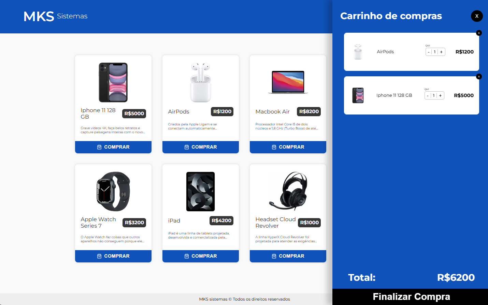

<h1 align="center">Frontend Challenge - E-Commerce</h1>

<h1 align="center">
    <a href="https://dj-frontend-challenge.vercel.app" target="blank">
        
        <small align="center">Clique para visitar o projeto🔗</small>
    </a>
</h1>

<h2>Descrição</h2>

Este é um projeto de página única para um e-commerce, desenvolvido como parte de um teste para uma vaga. A aplicação exibe uma lista de produtos que podem ser adicionados ao carrinho. Os usuários podem ajustar a quantidade de cada item no carrinho e visualizar o valor total da compra.

## Tecnologias Utilizadas

- Next.js: Framework React para renderização do lado do servidor.
- TypeScript: Superset de JavaScript que adiciona tipagem estática ao código.
- React Query: Biblioteca para gerenciamento de estado do servidor e consumo de APIs.
- Styled-components: Biblioteca para estilização com CSS-in-JS.
- Framer Motion: Biblioteca para animações.
- Redux: Biblioteca para gerenciamento de estado global.
- Jest: Framework de testes em JavaScript.
- Testing Library: Utilitários para testes de componentes React.

## Funcionalidades

- Exibição de uma lista de produtos.
- Adição de produtos ao carrinho.
- Ajuste da quantidade de produtos no carrinho.
- Cálculo do valor total da compra.
- Animações para uma melhor experiência do usuário.

## Estrutura do Projeto

- app/: Contém as páginas da aplicação, incluindo a página principal.
- \_components/: Componentes reutilizáveis da aplicação.
- store/: Configuração do Redux e slices para o gerenciamento do estado do carrinho.
- styles/: Estilos globais e temas para o styled-components.
- \_lib/: Utilitários e funções auxiliares.
